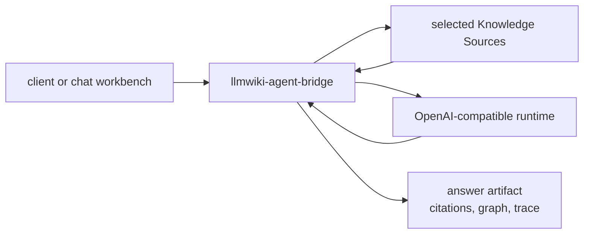

# LLMWiki Agent Bridge

[](https://github.com/knowledge-bridge-labs/llmwiki-agent-bridge/actions/workflows/ci.yml)
[](./LICENSE)
[](https://nodejs.org/)

`llmwiki-agent-bridge` is the optional source fan-out and runtime-synthesis
layer for the LLMWiki toolchain. It runs as a local HTTP service, gathers
evidence from one or more `llmwiki-serve` Knowledge Sources, and returns one
normalized answer artifact with citations, optional graph context, and trace
steps. It can run evidence-only for a first smoke test, or call an
OpenAI-compatible chat completions runtime for synthesized answers.

Use it when:

- A client wants one endpoint instead of managing source fan-out, prompting,
  runtime calls, citations, and trace shaping itself.
- You are connecting Hermes, DeepAgents, or a generic OpenAI-compatible local
  runtime to LLMWiki evidence.
- `llmwiki-chat` or another UI needs Agent Bridge A2A or MCP endpoints backed
  by local Knowledge Sources.

Skip it when your agent or script can call `llmwiki-serve` directly and manage
its own answer synthesis.

[Quick Start](#quick-start) | [Choose a Path](#choose-a-path) | [Demo](https://knowledge-bridge-labs.github.io/llmwiki-docs/demo) | [Runtime Profiles](./docs/runtime-profiles.md) | [Message Contract](./docs/message-send-contract.md) | [OpenAPI](./docs/openapi.json) | [Integrations](./integrations/README.md) | [Examples](./examples/README.md) | [Docs portal](https://knowledge-bridge-labs.github.io/llmwiki-docs/) | [Contributing](./CONTRIBUTING.md) | [Security](./SECURITY.md) | [Support](./SUPPORT.md) | [Changelog](./CHANGELOG.md)

> Public-preview note: source-checkout usage is the supported first-run path.
> Package-install commands apply after the first npm release is published.

For a visual first-run walkthrough, see the
[docs demo](https://knowledge-bridge-labs.github.io/llmwiki-docs/demo). It
shows the toolchain boundary: upstream workflows create compatible
Markdown/wiki files, `llmwiki-serve` projects them read-only as Knowledge
Sources, and the optional bridge can query selected served sources together.

It is not a Hermes-only bridge. Hermes is one supported runtime profile beside
`generic` and `deepagents`; all profiles use the same message contract and
return the same `llmwiki_agent_result` artifact shape.

It is independent community tooling for LLM Wiki-style Markdown knowledge
folders and agent-readable context. It is not an official project from Andrej
Karpathy or any upstream producer named in compatibility examples.

## Choose a Path

Start with the direct path whenever your client can call `llmwiki-serve`
itself. Add the bridge when you need fan-out, runtime synthesis, or a single
normalized result behind one local service.

| Path | Use when | Flow |
| --- | --- | --- |
| Direct to `llmwiki-serve` | Codex, Claude Code, Copilot, an IDE agent, or a script can safely call the Knowledge Source and handle its own prompting or synthesis. | `client -> llmwiki-serve` |
| Through `llmwiki-agent-bridge` | The client wants source fan-out, evidence bundling, OpenAI-compatible runtime synthesis, citations, graph context, and trace steps returned as one artifact. | `client -> bridge -> sources -> runtime -> artifact` |

Direct-client templates live in [integrations](./integrations/README.md). The
bridge request and artifact contract is documented in
[docs/message-send-contract.md](./docs/message-send-contract.md) and generated
as [docs/openapi.json](./docs/openapi.json).

## Quick Start

Requirements:

- Node.js `>=22.12`
- npm `>=10`
- One or more running `llmwiki-serve` Knowledge Source endpoints
- Optional: an OpenAI-compatible `/v1/chat/completions` runtime for synthesis
- `uv` and Python 3.11 or newer when starting the sample source from a checkout

This quickstart uses two checkouts. Keep Terminal 1 in the source-server
checkout and Terminal 2 in the bridge checkout so relative paths resolve in the
right repository.

### Terminal 1: source server

Clone and start the sample `llmwiki-serve` Knowledge Source. Leave this process
running:

```sh
git clone https://github.com/knowledge-bridge-labs/llmwiki-serve.git
cd llmwiki-serve
uv sync --extra dev
uv run llmwiki-serve serve ./examples/sample-wiki --host 127.0.0.1 --port 8765
```

### Terminal 2: bridge

Open Terminal 2 in the same parent workspace that contains the
`llmwiki-serve` checkout. Clone the bridge, install dependencies, and run the
local checks:

```sh
git clone https://github.com/knowledge-bridge-labs/llmwiki-agent-bridge.git
cd llmwiki-agent-bridge
npm ci
npm run check
```

From the bridge checkout, verify that Terminal 1 is serving the sample source:

```sh
curl -s http://127.0.0.1:8765/manifest
```

Start the bridge. The bundled sample request uses evidence-only mode, so the
first smoke test does not need provider credentials or a running model runtime:

```sh
node ./bin/llmwiki-agent-bridge.mjs
```

The CLI writes a JSON `ready` event when the bridge is listening:

```json
{
  "event": "ready",
  "url": "http://127.0.0.1:8788",
  "sourcePolicy": "private-http"
}
```

For runtime-backed answer synthesis, restart the bridge with the runtime profile
that matches your local runtime. This generic example works for any runtime that
implements OpenAI-compatible chat completions.

macOS/Linux:

```sh
LLMWIKI_AGENT_BRIDGE_BASE_URL=http://127.0.0.1:8642/v1 \
LLMWIKI_AGENT_BRIDGE_MODEL=local-model \
LLMWIKI_AGENT_BRIDGE_RUNTIME_PROFILE=generic \
node ./bin/llmwiki-agent-bridge.mjs
```

Windows PowerShell:

```powershell
$env:LLMWIKI_AGENT_BRIDGE_BASE_URL = 'http://127.0.0.1:8642/v1'
$env:LLMWIKI_AGENT_BRIDGE_MODEL = 'local-model'
$env:LLMWIKI_AGENT_BRIDGE_RUNTIME_PROFILE = 'generic'
node .\bin\llmwiki-agent-bridge.mjs
```

For Hermes or DeepAgents, keep the same command shape and change
`LLMWIKI_AGENT_BRIDGE_RUNTIME_PROFILE` plus the model name:

| Profile | Use when | Example model |
| --- | --- | --- |
| `generic` | Any local runtime that implements `/v1/chat/completions`. | `local-model` |
| `hermes` | Hermes or a Hermes-compatible local gateway. | `hermes-agent` |
| `deepagents` | DeepAgents behind an OpenAI-compatible endpoint. | `deepagents-local` |

Leave the bridge running. The following commands are also bridge-checkout
commands; if Terminal 2 is occupied by the bridge process, open another prompt
and run `cd llmwiki-agent-bridge` first.

Check the local surface:

```sh
curl -s http://127.0.0.1:8788/health
curl -s http://127.0.0.1:8788/.well-known/agent-card.json
curl -s http://127.0.0.1:8788/settings.json
```

For the first run, open `http://127.0.0.1:8788/settings` and follow the guided
setup:

1. Connect runtime when you want synthesis. Set the runtime profile, base URL,
   and model. The page saves these fields through `PUT /settings/config.json`.
2. Register Knowledge Sources. Add the sample source at
   `http://127.0.0.1:8765`, mark it ready and selected, then save it through
   `GET/PUT /settings/sources.json`.
3. Verify Bridge. Run the settings-page verification, which sends
   `POST /message:send` using the registered source and shows the returned
   answer artifact, citations, graph, and trace steps.

Runtime credentials, network, auth, CORS, timeout, and source-policy controls live under
diagnostics/advanced. Most local OSS users only need the three setup steps
above.

Send the sample request from the `llmwiki-agent-bridge` checkout so the
`--data @examples/message-send.local.json` path resolves to this repository:

```sh
curl -s http://127.0.0.1:8788/message:send \
  -H 'content-type: application/json' \
  --data @examples/message-send.local.json
```

The bundled `examples/message-send.local.json` points at
`http://127.0.0.1:8765`. If your `llmwiki-serve` or bridge process uses a
different port, copy that file to a temporary path, update the source URL, and
post it to the bridge URL you started.

MCP-style clients can list bridge tools at `/mcp`. Use
`llmwiki_agent_run` when you want the bridge to produce a full grounded answer,
or use the read-only source tools when your host agent wants to inspect sources
progressively:

```sh
curl -s http://127.0.0.1:8788/mcp \
  -H 'content-type: application/json' \
  -d '{"jsonrpc":"2.0","id":1,"method":"tools/list"}'

curl -s http://127.0.0.1:8788/mcp \
  -H 'content-type: application/json' \
  -d '{"jsonrpc":"2.0","id":2,"method":"tools/call","params":{"name":"llmwiki_agent_run","arguments":{"query":"release readiness"}}}'

curl -s http://127.0.0.1:8788/mcp \
  -H 'content-type: application/json' \
  -d '{"jsonrpc":"2.0","id":3,"method":"tools/call","params":{"name":"llmwiki_context","arguments":{"sourceId":"sample-wiki","query":"release readiness","limit":5}}}'

curl -s http://127.0.0.1:8788/mcp \
  -H 'content-type: application/json' \
  -d '{"jsonrpc":"2.0","id":4,"method":"tools/call","params":{"name":"llmwiki_graph_neighbors","arguments":{"sourceId":"sample-wiki","nodeId":"sample-wiki:overview","direction":"out","relation":"supports","limit":20}}}'
```

Omit `knowledgeSources` to use sources registered through `/settings`. Passing
`knowledgeSources: []` means "run with no sources" and is useful only for
negative tests.
The human-readable source list omits endpoint URLs. The structured
`llmwiki_sources.sources` descriptors include source URLs so local workbenches
can select bridge-managed sources and pass them back to `/message:send`.
Do not copy private local URLs into public docs, issues, or examples.

The sample request asks `release readiness`. Exact answer wording may vary by
runtime; the stable integration target is the completed task plus the
`llmwiki_agent_result` data artifact fields:

```json
{
  "answer": "Grounded answer text from the configured runtime.",
  "citations": [
    {
      "sourceId": "sample-wiki",
      "pageId": "release-readiness",
      "title": "Release Readiness",
      "score": 0.92
    }
  ],
  "graph": {
    "nodes": [],
    "edges": []
  },
  "steps": [
    {
      "id": "bridge-evidence",
      "label": "Prepare evidence",
      "status": "done"
    },
    {
      "id": "runtime-chat-completions",
      "label": "Call chat completions",
      "status": "done"
    }
  ]
}
```

For complete payloads and local setup notes, use
[examples](./examples/README.md), [runtime profiles](./docs/runtime-profiles.md),
the [message contract](./docs/message-send-contract.md), and
[client paths](./docs/client-paths.md).

## What It Does

The bridge exposes one small local HTTP surface:

| Endpoint | Purpose |
| --- | --- |
| `GET /health` | Runtime, configuration, source policy, and redacted source-registry readiness snapshot. |
| `GET /.well-known/agent-card.json` | Local A2A-style agent card metadata with redacted source-registry readiness counts. |
| `GET /settings` | Guided local setup UI: connect runtime, register Knowledge Sources, and verify with `POST /message:send`. |
| `GET /settings.json` | Redacted runtime, bridge, persistence, and endpoint metadata. |
| `PUT /settings/config.json` | Persists runtime configuration plus advanced access, CORS, timeout, and source-policy settings. |
| `GET/PUT /settings/sources.json` | Reads or persists registered Knowledge Sources. |
| `POST /message:send` | A2A-style request that returns a completed task artifact. |
| `POST /mcp` | MCP-style JSON-RPC endpoint with `llmwiki_agent_run` plus read-only source tools. |

For each `POST /message:send` request, the bridge:

1. Selects ready Knowledge Source descriptors from the request.
2. Fetches context over `llmwiki-http`, MCP-style JSON-RPC, or A2A-style HTTP.
3. Packages citations, graph context, source bundle metadata, and trace steps.
4. In `delegated-runtime` or `hybrid`, compacts the evidence bundle and calls
   the configured OpenAI-compatible `/v1/chat/completions` endpoint.
5. In `evidence-only`, skips the runtime call and returns a bridge-generated
   evidence summary.
6. Returns answer text plus the `llmwiki_agent_result` artifact.

`POST /mcp` exposes two layers. `llmwiki_agent_run` calls the same internal run
path as `/message:send` and returns text content plus
`structuredContent.llmwiki_agent_result`. The read-only source tools
`llmwiki_list_sources`, `llmwiki_context`, `llmwiki_search`, `llmwiki_read`,
`llmwiki_graph`, `llmwiki_graph_neighbors`, and `llmwiki_source_bundle` do not
call the configured runtime; they let a host agent list sources, read
orientation-first context, search, open a page, inspect graph data, traverse a
bounded neighborhood, or read safe source-bundle metadata before deciding
whether more source exploration or a full answer run is needed.

Requests may supply `knowledgeSources` directly, or omit them and use the
bridge's registered Knowledge Sources. Register sources in Step 2 of
`/settings` or by calling `PUT /settings/sources.json` with a `sources` array.
Multiple ready, selected sources can be registered and queried in one run.
Source calls are bounded internally rather than sent with unbounded parallelism.
The returned artifact is normalized back to the selected source order for
citations, graph data, source bundles, trace steps, diagnostics, and per-source
failures.

`/message:send` keeps the legacy `data.query` contract and also accepts
additive conversation runtime context: `data.message` or top-level A2A
`message`, `data.messages`, `data.threadId`, `data.sessionId`, `data.turnId`,
`data.runtimeContext.conversation`, A2A-style `configuration.historyLength`,
and A2A-style `metadata.threadId/sessionId/turnId`. The bridge uses the current
query from `data.query` or A2A message text for source retrieval, then includes
bounded user/assistant conversation history in the runtime chat-completions call
after the evidence system prompt.

### Safe request audit logging

Set `LLMWIKI_AGENT_BRIDGE_AUDIT_LOG=1` or pass `auditLog: true` to emit one
JSON line per audited bridge request through the existing logger (`stdout` by
default). Audited routes are `/message:send`, `/mcp`, `/settings`,
`/settings.json`, `/settings/config.json`, `/settings/sources.json`,
`/.well-known/agent-card.json`, and `/health`.

Audit events are intentionally allowlisted. They include route patterns, status,
duration, request/trace IDs, orchestration mode, runtime-called state, source and
artifact counts, conversation count/boolean fields, and redaction flags. They do
not include raw prompts, runtime answers, request or response bodies, query
strings, source URLs, runtime base URLs, model names, API keys, bearer tokens,
local paths, thread/session IDs, or conversation message content.



Supported Knowledge Source protocols:

| Protocol | Behavior |
| --- | --- |
| `llmwiki-http` | Calls `GET /source-bundle` or legacy `GET /manifest` for safe bundle metadata, then calls `POST /query` and augments evidence with compact search variants. |
| `mcp` | Calls `llmwiki_source_bundle` for safe bundle metadata when available, then calls `llmwiki_context` through a JSON-RPC MCP-style endpoint at `/mcp`. |
| `a2a` | Reads `/.well-known/agent-card.json`, posts a message, and prefers a `llmwiki_context` artifact when present. |

The generated OpenAPI contract is committed at
[docs/openapi.json](./docs/openapi.json). It covers the bridge's local HTTP
surface and the `llmwiki_agent_result` artifact shape as a public-preview
compatibility contract, not as certified A2A conformance.

The package includes `@a2a-js/sdk@0.3.13` for A2A discovery compatibility
checks while keeping the existing `/message:send` route stable.

## Runtime Profiles

Profiles are conservative configuration presets over the same bridge contract.
They change runtime identity metadata, default model naming, and
operator-facing configuration; they do not change the LLMWiki evidence format.

| Profile | Use when | Typical model variable |
| --- | --- | --- |
| `generic` | Running any local runtime that implements OpenAI-compatible `/v1/chat/completions`. | `LLMWIKI_AGENT_BRIDGE_MODEL=local-model` |
| `hermes` | Running Hermes or a Hermes-compatible local gateway. | `LLMWIKI_AGENT_BRIDGE_MODEL=hermes-agent` |
| `deepagents` | Running DeepAgents behind an OpenAI-compatible chat completions endpoint. | `LLMWIKI_AGENT_BRIDGE_MODEL=deepagents-local` |

Legacy `HERMES_*` and `HERMES_A2A_BRIDGE_*` environment aliases remain
available for migration. New deployments should prefer the
`LLMWIKI_AGENT_BRIDGE_*` variables.

More detail: [docs/runtime-profiles.md](./docs/runtime-profiles.md).

## Package Surface

`llmwiki-agent-bridge` ships one Node package with these public entry points:

| Surface | Purpose |
| --- | --- |
| `llmwiki-agent-bridge` CLI | Starts the local bridge from a checkout or published package. |
| `startAgentBridge` | Programmatic API for tests, local tooling, or embedded bridge processes. |
| `docs/openapi.json` | Generated local HTTP and artifact contract. |
| `examples/message-send.local.json` | Minimal local request for smoke testing. |
| `integrations/` | Direct-client templates and routing guidance for Codex, Claude Code, and Copilot. |

After npm publication, the intended package entrypoint is:

```sh
npx llmwiki-agent-bridge
```

Until then, source-checkout usage is the supported path.

## Integration Paths

Direct-client integrations are the best first choice when the agent can safely
retrieve context from `llmwiki-serve` itself. Bridge integrations are a better
fit when a client wants one local service to gather evidence, call a runtime,
and return a normalized result.

- [Client path guide](./docs/client-paths.md)
- [Integrations overview](./integrations/README.md)
- [Codex skill example](./integrations/codex/skills/llmwiki-serve/SKILL.md)
- [Claude Code command example](./integrations/claude-code/commands/llmwiki-query.md)
- [Copilot instructions example](./integrations/copilot/copilot-instructions.md)

For direct agent use, run `llmwiki-serve`, set `LLMWIKI_SERVE_URL`, and adapt
the templates in `integrations/`. The examples call `/query` first, then
`/search`, `/read/{page_id}`, `/graph`, or `/mcp` for narrower inspection.

```sh
export LLMWIKI_SERVE_URL=http://127.0.0.1:8765
```

Use `llmwiki-agent-bridge` when the workflow also needs source fan-out,
OpenAI-compatible runtime synthesis, and one normalized answer artifact.

## Configuration

Most local runs only need the runtime base URL, model, profile, and optional
bridge bearer token:

| Variable | Default | Purpose |
| --- | --- | --- |
| `LLMWIKI_AGENT_BRIDGE_BASE_URL` | `http://127.0.0.1:8642/v1` | OpenAI-compatible chat completions base URL. |
| `LLMWIKI_AGENT_BRIDGE_MODEL` | `hermes-agent` | Chat completions model name. |
| `LLMWIKI_AGENT_BRIDGE_RUNTIME_PROFILE` | `hermes` | Runtime profile preset: `hermes`, `deepagents`, or `generic`. |
| `LLMWIKI_AGENT_BRIDGE_HOST` | `127.0.0.1` | Bridge bind host; non-loopback values require explicit opt-in. Host changes saved from `/settings` require restart. |
| `LLMWIKI_AGENT_BRIDGE_PORT` | `8788` | Bridge HTTP port. Port changes saved from `/settings` require restart. |
| `LLMWIKI_AGENT_BRIDGE_API_KEY` | unset | Optional runtime API key sent only to the configured runtime. |
| `LLMWIKI_AGENT_BRIDGE_BEARER_TOKEN` | unset | Optional bearer token required by bridge HTTP requests. |
| `LLMWIKI_AGENT_BRIDGE_ALLOWED_ORIGINS` | unset | Extra browser CORS origins allowed to call the bridge. |
| `LLMWIKI_AGENT_BRIDGE_SOURCE_POLICY` | `private-http` | Outbound Knowledge Source URL policy. |
| `LLMWIKI_AGENT_BRIDGE_ALLOWED_SOURCE_ORIGINS` | unset | Exact Knowledge Source origins for allowlist or stricter policies. |
| `LLMWIKI_AGENT_BRIDGE_ALLOW_PUBLIC_BIND` | unset | Set to `1` before binding to a non-loopback host. |
| `LLMWIKI_AGENT_BRIDGE_CONFIG_PATH` | user config file in the CLI | Persistent settings file for `/settings/config.json` and `/settings/sources.json`; programmatic callers can pass `configPath`. |

Source policy, CORS, bind-host, and migration alias details are documented in
[runtime profiles](./docs/runtime-profiles.md) and
[client paths](./docs/client-paths.md).

The implementation keeps Hermes defaults for backward compatibility. For a new
OSS install, set `LLMWIKI_AGENT_BRIDGE_RUNTIME_PROFILE=generic` explicitly
unless you are connecting Hermes or DeepAgents, and set the model name expected
by that runtime.

Do not expose the bridge on a public or shared interface without
`LLMWIKI_AGENT_BRIDGE_BEARER_TOKEN`. Non-loopback binds require an explicit
opt-in, and public unauthenticated binds are a development-only escape hatch.

The `/settings` page is the guided first-run UI over the same configuration.
Step 1 connects the runtime and saves profile, base URL, and model through
`PUT /settings/config.json`. Step 2 saves reusable Knowledge Source descriptors
through `GET/PUT /settings/sources.json`. Step 3 verifies the bridge by sending
`POST /message:send` from the page and showing the returned artifact. Runtime
credentials, advanced network, auth, CORS, timeout, and source-policy fields
are still available under diagnostics/advanced; changes to live runtime fields
apply to the running process. Bind `host` and `port` are saved for the next
start and the save response lists them under `restartRequired`.

## Programmatic API

```js
import { startAgentBridge } from 'llmwiki-agent-bridge'

const { server, url } = await startAgentBridge({
  port: 0,
  baseUrl: 'http://127.0.0.1:8642/v1',
  model: 'local-model',
  runtimeProfile: 'generic',
})

console.log(url)
server.close()
```

Legacy `createHermesA2aBridge` and `startHermesA2aBridge` exports are available
during migration.

## Repository Structure

| Path | Purpose |
| --- | --- |
| `bin/` | CLI entry point for starting the bridge from a checkout or package. |
| `src/` | Bridge server, source clients, runtime call path, and result shaping. |
| `examples/` | Sample local A2A-style request payloads. |
| `integrations/` | Direct agent templates for Codex, Claude Code, Copilot, and bridge routing guidance. |
| `docs/` | Runtime profiles, OpenAPI contract, client paths, and release guidance. |
| `test/` | Bridge behavior and contract tests. |
| `scripts/` | Maintenance and release helper scripts. |
| `package.json`, `package-lock.json` | Node package metadata and locked development environment. |

## Release Status

`llmwiki-agent-bridge` is in public source-checkout preview. Source-checkout
usage is the supported path today. npm package-install links should be treated
as release gates until the first package is published.

Repository, issue, CI badge, package, and hosted docs URLs intentionally target
the Knowledge Bridge Labs organization. The hosted Release Status &
Compatibility matrix records which package and runtime paths are currently
available.

See [docs/release.md](./docs/release.md) before publishing or tagging a public
preview.

## Development

```sh
npm run lint
npm run contracts:check
npm test
npm run pack:dry-run
npm run audit
```

`npm run check` runs lint, generated-contract drift checks, tests, and dry
packaging.

## Toolchain

| Repo/package | Role | Validation command |
| --- | --- | --- |
| `llmwiki-serve` | Read-only Knowledge Source server for Markdown or LLMWiki-style folders. | `uv run python scripts/release_smoke.py` |
| `llmwiki-agent-bridge` | Local runtime companion bridge for cited answer artifacts. | `npm run check` |
| `llmwiki-chat` | Browser workbench for sources, runtime selection, traces, citations, and graph context. | `npm run check` |
| `llmwiki-docs` | Cross-repo documentation portal. | `npm run check` |

## Community

Before opening a pull request, read [CONTRIBUTING.md](./CONTRIBUTING.md), keep
changes focused on the bridge contract, and include validation results.

Use GitHub issues for reproducible bugs, focused feature requests, runtime or
protocol compatibility notes, and documentation gaps. Keep examples public and
sanitized; do not include credentials, bearer tokens, private endpoint URLs, raw
sensitive wiki content, or private runtime logs.

- [Bug reports](https://github.com/knowledge-bridge-labs/llmwiki-agent-bridge/issues/new?template=bug_report.yml)
- [Runtime or protocol compatibility](https://github.com/knowledge-bridge-labs/llmwiki-agent-bridge/issues/new?template=runtime_protocol.yml)
- [Feature requests](https://github.com/knowledge-bridge-labs/llmwiki-agent-bridge/issues/new?template=feature_request.yml)
- [Documentation issues](https://github.com/knowledge-bridge-labs/llmwiki-agent-bridge/issues/new?template=documentation.yml)
- [Security policy](./SECURITY.md)
- [Support guide](./SUPPORT.md)
- [Code of conduct](https://github.com/knowledge-bridge-labs/llmwiki-agent-bridge/blob/main/CODE_OF_CONDUCT.md)

For vulnerabilities, follow [SECURITY.md](./SECURITY.md) instead of opening a
detailed public issue.

## License

Apache-2.0. See [LICENSE](./LICENSE).
